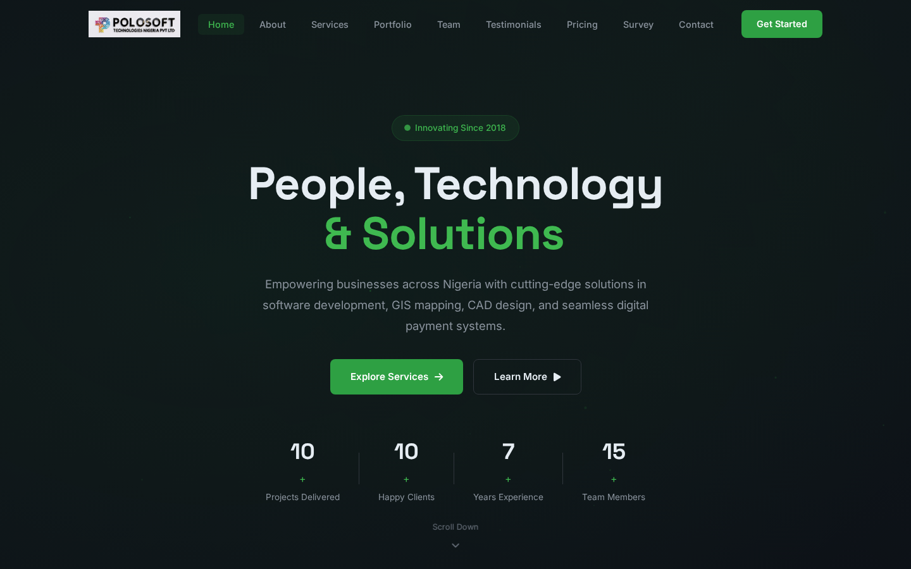

# Polosoft Technologies Nigeria: Company Website

Single-page company website for Polosoft Technologies Nigeria, a Lagos-based technology services company working in GIS, application development, CAD and payment solutions.

**Live site:** https://polosoft-website.vercel.app

[](https://polosoft-website.vercel.app)

## Sections

| Section | What it contains |
|---|---|
| **Home** | Hero with a typing headline ("People, Technology & Platforms / Innovation / Solutions / Growth"), call-to-action buttons and animated stat counters |
| **About** | Company overview with an animated "ecosystem" graphic (GIS, Apps, Cloud, CAD, Payments, ERP, IoT) |
| **Services** | Six service cards: GIS Services, Application Development, CAD Services, Payment Solutions, Cloud & DevOps, ERP & CRM Solutions |
| **Why Choose Us** | Four reasons the company highlights |
| **Portfolio** | Project cards with filters (All, Web Apps, Mobile, GIS, Payments) |
| **Process** | Four-step workflow: Discovery, Design, Development, Launch & Support |
| **Team** | Team cards with roles |
| **Testimonials** | Auto-advancing slider with previous/next buttons and dots |
| **Pricing** | Starter, Professional and Enterprise plans (quote-based) |
| **Survey** | Embedded ArcGIS Survey123 field data-collection form that resizes itself to fit, with an "open in a new tab" fallback |
| **FAQ** | Accordion of common questions |
| **Contact** | Address, email and phone details, social links, and an enquiry form with a thank-you pop-up |
| **Footer** | Quick links, service links and a newsletter sign-up field |

## Front-end features

- Preloader and a custom cursor follower on desktop
- Sticky navbar that changes on scroll and highlights the section you're viewing
- Mobile menu toggle, plus responsive layouts at 1080, 1024, 768 and 480 px breakpoints
- Scroll-reveal animations (AOS) and floating particles in the hero
- Animated stat counters that start when they scroll into view
- Back-to-top button

## Tech stack

- **HTML5, CSS3 and vanilla JavaScript**: one `index.html`, one stylesheet (`css/style.css`) and one script (`js/main.js`), with no framework and no build step
- **[AOS](https://michalsnik.github.io/aos/) 2.3.4** for scroll animations (via cdnjs)
- **[Font Awesome](https://fontawesome.com/) 6.5.1** for icons (via cdnjs)
- **Google Fonts:** Inter and Space Grotesk
- **[FormSubmit](https://formsubmit.co/)** sends the contact form by email
- **[ArcGIS Survey123](https://survey123.arcgis.com/)** web form embed for the Survey section
- **Hosting:** Vercel

## Project structure

```
.
├── index.html      # the whole page
├── css/style.css   # styles and responsive breakpoints
├── js/main.js      # interactions and animations
├── images/         # logo, brand icon, favicons, team photo
├── favicon.ico
└── makezip.py      # packages the site into polosoft-website.zip for upload
```

## Run locally

It's a static site, so any static file server works:

```bash
git clone https://github.com/collins-geodev/polosoft-website.git
cd polosoft-website
python3 -m http.server 8000   # then open http://localhost:8000
```

To package the site as a zip (`index.html`, `favicon.ico`, `css/`, `js/`, `images/`):

```bash
python3 makezip.py
```

## Author

Built by **Collins Anyanwu** · [GitHub](https://github.com/collins-geodev)
